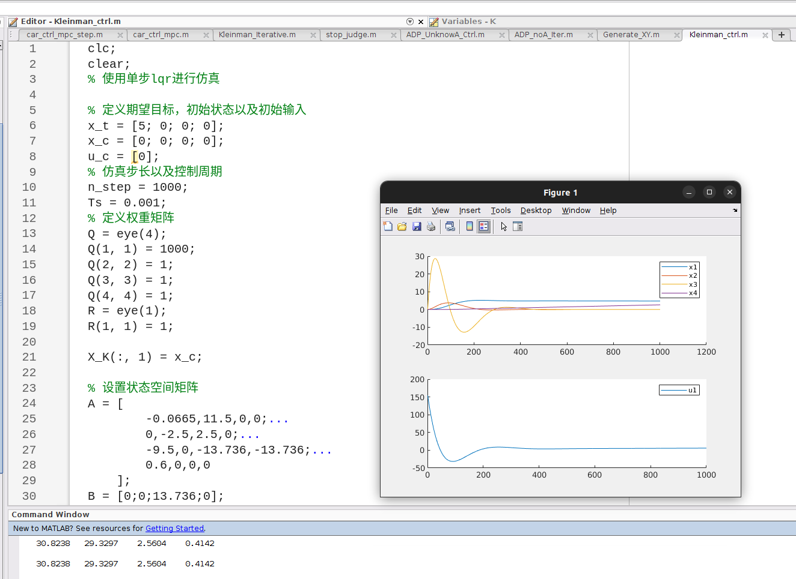

## 一、论文内容概括

为了验证复现工作的正确性，我们参考文献[2]中的电力控制系统进行了实验。在文献[2]中，提供了以下实验参数：真实的系统动力学方程矩阵 (A_{\text{real}}) 和 (B)，标称（待矫正）的系统动力学方程矩阵 (A_{\text{nom}}) 和 (B)，系统代价函数中的矩阵 (Q) 和 (R)，以及系统初始状态变量 (X_0)。针对文献[1]-[3]的复现工作，分别采用以下设定：

1. Kleinman迭代算法

   这篇论文主要提出了一种通过迭代求解Algebraic Riccati Equation方程，从而实现LQR控制的方法。

2. ADP算法（未知 (A)）

   该论文提出了Actor/Ctritic迭代机制，用Critic迭代来拟合真实的系统模型，通过已知的反馈增益矩阵以及系统状态计算系统输入，用最小二乘法直接拟合系统的输入输出从而得到 Riccati 方程的解P矩阵，再通过P矩阵对反馈增益矩阵K进行迭代，也就是Actor。

3. ADP算法（未知 (A) 和 (B)）

   该论文提出了在算法对系统动力学方程一无所知的情况下，完全依赖系统采样的状态变量，迭代求解矩阵 P 和 K，经过多次迭代收敛，能够笔记最优控制。

## 二、实验结果

#### Kleinman迭代算法

使用Kleinman迭代算法可以直接计算出针对系统的反馈增益矩阵，为了验证实验效果，一方面可以将得到的反馈增益矩阵与matlab中lqr模块计算出来的反馈增益矩阵进行对比，另一方面可以直接使用反馈增益矩阵对系统进行控制，以验证其性能。直接运行`Kleinman_ctrl.m`即可输出。

如上图，最下方输出两行向量分别是`kleinman`迭代的结果以及`lqr()`函数计算的结果，他们完全一致。

同时，我选用论文中的电力系统进行模拟，结果如 `Figure 1` 中所示，系统在反馈控制率下能够逐渐收敛到给定期望。

#### ADP算法（未知 (A)）

正在进行实验，按照论文的方法编写迭代计算代码

#### ADP算法（未知 (A) 和 (B)）

尚未完成实验